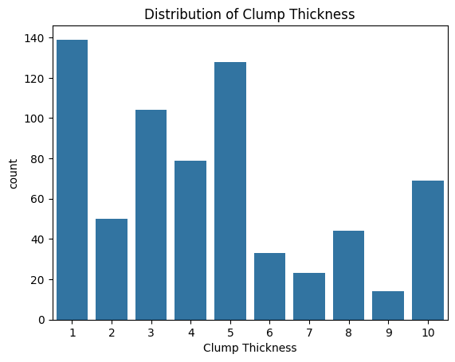
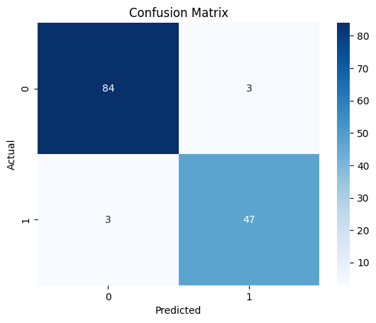
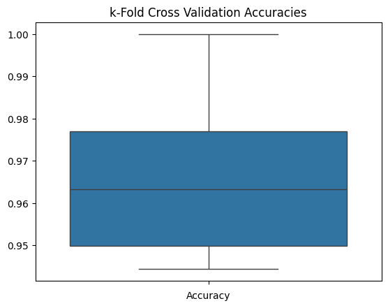

# Logistic Regression for Breast Cancer Classification

This project demonstrates the implementation of a Logistic Regression model to classify breast cancer data. The steps below detail the process from importing libraries and data, to training the model and evaluating its performance.

## Table of Contents
- [Installation](#installation)
- [Dataset](#dataset)
- [Implementation](#implementation)
  - [Importing the Libraries](#importing-the-libraries)
  - [Importing the Dataset](#importing-the-dataset)
  - [Splitting the Dataset](#splitting-the-dataset)
  - [Training the Model](#training-the-model)
  - [Predicting Test Results](#predicting-test-results)
  - [Visualizing the Dataset](#visualizing-the-dataset)
  - [Evaluating the Model](#evaluating-the-model)
    - [Confusion Matrix](#confusion-matrix)
    - [Accuracy](#accuracy)
    - [k-Fold Cross Validation](#k-fold-cross-validation)
- [Results](#results)

## Installation

Ensure you have Python and the following libraries installed:
- pandas
- scikit-learn
- seaborn
- matplotlib

You can install the required libraries using pip:
```sh
pip install pandas scikit-learn seaborn matplotlib
```

## Dataset

The dataset used is `breast_cancer.csv`. Make sure this file is in the same directory as your script or provide the correct path to the file.

## Implementation

### Importing the Libraries

```python
import pandas as pd
import seaborn as sns
import matplotlib.pyplot as plt
from sklearn.model_selection import train_test_split
from sklearn.linear_model import LogisticRegression
from sklearn.metrics import confusion_matrix, accuracy_score
from sklearn.model_selection import cross_val_score
```

### Importing the Dataset

```python
dataset = pd.read_csv("breast_cancer.csv")
X = dataset.iloc[:, 1:-1].values
y = dataset.iloc[:, -1].values

dataset.head()
```

### Splitting the Dataset

```python
X_train, X_test, y_train, y_test = train_test_split(X, y, test_size=0.2, random_state=0)
```

### Training the Model

```python
classifier = LogisticRegression(random_state=0)
classifier.fit(X_train, y_train)
```

### Predicting Test Results

```python
y_pred = classifier.predict(X_test)
```

### Visualizing the Dataset

```python
sns.countplot(x='Clump Thickness', data=dataset)
plt.title('Distribution of Clump Thickness')
plt.show()

# Uncomment the lines below to see the pairplot (note: this may take some time for large datasets)
# sns.pairplot(dataset, hue='Class')
# plt.title('Pairplot of Dataset')
# plt.show()
```


*The graph shows the frequency distribution of Clump Thickness in the dataset.*

### Evaluating the Model

#### Confusion Matrix

```python
cm = confusion_matrix(y_test, y_pred)
print(cm)

sns.heatmap(cm, annot=True, fmt='d', cmap='Blues')
plt.xlabel('Predicted')
plt.ylabel('Actual')
plt.title('Confusion Matrix')
plt.show()
```


*The confusion matrix visualizes the model's performance by comparing predicted and actual classifications.*

#### Accuracy

```python
print(accuracy_score(y_test, y_pred))
```
Output: 
```
0.9562043795620438 (95.62%)
```

#### k-Fold Cross Validation

```python
accuracies = cross_val_score(estimator=classifier, X=X_train, y=y_train, cv=10)
print("Accuracy: {:0.2f} %".format(accuracies.mean() * 100))
print("Standard Deviation: {:0.2f} %".format(accuracies.std() * 100))

sns.boxplot(data=accuracies)
plt.title('k-Fold Cross Validation Accuracies')
plt.xlabel('Accuracy')
plt.show()
```
Output: 
```
Accuracy: 96.70 %
Standard Deviation: 1.97 %
```



*The boxplot illustrates the distribution of accuracies across 10-fold cross-validation, showing the model's robustness and consistency.*

## Results

This Logistic Regression model demonstrates a high accuracy of approximately 95.62% on the test set and an average cross-validation accuracy of 96.70% with a standard deviation of 1.97%, indicating a reliable model with consistent performance.
